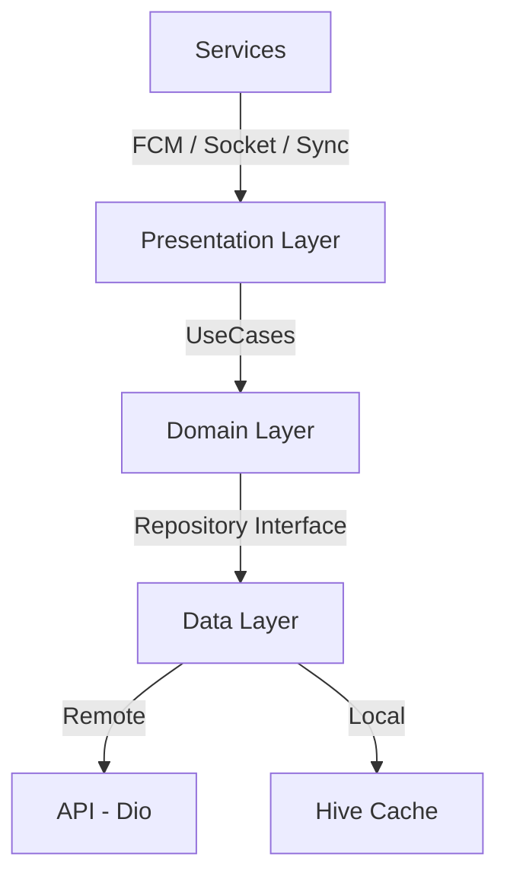

# Notification App

Ứng dụng Flutter quản lý thông báo thời gian thực (realtime), hỗ trợ offline-first, đồng bộ hàng đợi, và push notification qua FCM.


## Tính năng chính

| Tính năng | Mô tả |
|-----------|-------|
| **📬 Push Notification** | Nhận thông báo qua Firebase Cloud Messaging (foreground + background + terminated) |
| **🔔 Local Notification** | Hiển thị notification trên thiết bị khi app ở foreground |
| **⚡ Realtime** | Nhận thông báo tức thời qua Socket.io khi app đang mở |
| **📶 Offline-first** | Dữ liệu cache local bằng Hive, hoạt động khi không có mạng |
| **🔄 Sync Queue** | Hàng đợi đồng bộ tự động — thao tác offline sẽ được gửi lên server khi có mạng |
| **✅ Optimistic UI** | Mark-as-read cập nhật UI ngay lập tức, tự revert nếu API fail |
| **📄 Pagination** | Load more dạng cursor-based với deduplication |
| **🔧 Settings** | Quản lý topic subscription (FCM) và preferences |

## Demo màn hình

   

## Kiến trúc

```
Clean Architecture + Feature-first
```



### Cấu trúc thư mục

```
lib/
├── core/
│   ├── constants/
│   │   ├── api_constants.dart          # Base URL, endpoints, pagination
│   │   ├── app_constants.dart          # Storage keys, sync, socket config
│   │   └── hive_constants.dart         # Box names, type IDs
│   ├── network/
│   │   ├── dio_client.dart             # Singleton Dio instance
│   │   └── auth_interceptor.dart       # Token injection & refresh
│   ├── theme/
│   │   └── app_theme.dart
│   └── utils/
│       ├── logger.dart                 # Debug logger (tag-based)
│       └── date_formatter.dart         # Relative time (vừa xong, 5 phút trước...)
│
├── data/
│   ├── datasources/
│   │   ├── remote_data_source.dart     # API calls (GET /notifications, POST /read)
│   │   └── local_data_source.dart      # Hive CRUD + sync queue operations
│   ├── models/
│   │   ├── notification_model.dart     # HiveObject with fromJson, status helpers
│   │   ├── notification_model.g.dart   # Hive generated adapter
│   │   ├── sync_task.dart              # Queued offline operations
│   │   └── sync_task.g.dart
│   └── repositories/
│       ├── notification_repository.dart  # Cache-first strategy + offline fallback
│       └── notification_local_repo.dart  # Repository interface
│
├── features/
│   ├── notifications/
│   │   ├── domain/usecases/
│   │   │   ├── get_notifications_usecase.dart   # Fetch + merge + dedup
│   │   │   ├── mark_read_usecase.dart           # Mark read via repo
│   │   │   └── sync_queue_usecase.dart          # Process offline queue
│   │   └── presentation/
│   │       ├── bindings/
│   │       │   └── notification_binding.dart     # GetX DI (page-scoped)
│   │       ├── controllers/
│   │       │   ├── notification_controller.dart  # State + pagination + realtime
│   │       │   └── settings_controller.dart      # Topic subscription toggles
│   │       ├── views/
│   │       │   └── notification_list_view.dart   # Main screen (pull-refresh, load more)
│   │       └── widgets/
│   │           ├── notification_card.dart        # Item UI (type icon, unread dot)
│   │           ├── unread_badge.dart             # AppBar badge counter
│   │           └── shimmer_card.dart             # Loading skeleton
│   ├── settings/
│   │   └── presentation/
│   │       └── settings_view.dart
│   └── home/
│
├── services/
│   ├── fcm_service.dart               # FCM setup, foreground/background handling
│   ├── socket_service.dart            # Socket.io with lifecycle management
│   ├── hive_service.dart              # Box management, migration, CRUD
│   ├── connectivity_service.dart      # Online/offline detection (stream-based)
│   └── sync_service.dart              # Bridges connectivity → sync queue
│
├── routes/
│   └── app_pages.dart                 # GetX route definitions
│
└── main.dart                          # Entry point, DI setup, Firebase init
```

## Tech Stack

| Category | Technology |
|----------|-----------|
| **Framework** | Flutter 3.11 / Dart 3.11 |
| **State Management** | GetX (GetMaterialApp, Bindings, RxList) |
| **Local Storage** | Hive + Hive Flutter |
| **Network** | Dio 5.x + Interceptors |
| **Push Notifications** | Firebase Cloud Messaging (FCM) 16.x |
| **Local Notifications** | flutter_local_notifications 21.x |
| **Realtime** | socket_io_client 3.x |
| **Connectivity** | connectivity_plus 7.x |
| **Session Storage** | GetStorage |

## Luồng dữ liệu

### 1. Push Notification (FCM)

```
┌────────────┐     ┌──────────────┐     ┌───────────┐
│ FCM Server  │────▶│ Background   │────▶│ Hive      │
│             │     │ Handler      │     │ (persist) │
└────────────┘     └──────────────┘     └───────────┘
       │
       │ (app foreground)
       ▼
┌──────────────┐     ┌───────────┐     ┌────────────┐
│ FcmService   │────▶│ Hive      │────▶│ Controller │
│ (foreground) │     │ (persist) │     │ (RxList)   │
└──────────────┘     └───────────┘     └────────────┘
```

### 2. Offline Sync Queue

```
┌──────────┐  offline  ┌───────────┐  online  ┌───────────┐
│ User taps │─────────▶│ SyncTask  │─────────▶│ API call  │
│ mark read │          │ (Hive Q)  │          │ (Dio)     │
└──────────┘           └───────────┘          └───────────┘
                              │
                              │ retry < 3 → increment
                              │ retry ≥ 3 → abandon
```

### 3. Socket.io Lifecycle

```
App resumed  ──▶ connect(token) ──▶ listen('new_notification')
App paused   ──▶ disconnect + dispose (saves battery)
App hidden   ──▶ disconnect + dispose
```

## Cài đặt

### Yêu cầu

- Flutter SDK ≥ 3.11.4
- Dart SDK ≥ 3.11.4
- Firebase project đã cấu hình (google-services.json / GoogleService-Info.plist)

### Các bước

```bash
# 1. Clone repository
git clone <repo-url>
cd notification_app

# 2. Cài đặt dependencies
flutter pub get

# 3. Generate Hive adapters
dart run build_runner build --delete-conflicting-outputs

# 4. Cấu hình Firebase
# - Đặt google-services.json vào android/app/
# - Đặt GoogleService-Info.plist vào ios/Runner/
# - Cập nhật firebase_options.dart nếu cần

# 5. Chạy ứng dụng
flutter run
```

## Cấu hình

### API

Cập nhật base URL và socket URL trong `lib/core/constants/api_constants.dart`:

```dart
abstract class ApiConstants {
  static const String baseUrl = 'https://api.safegate.com/';
  static const String socketUrl = 'https://api.safegate.com';
  // ...
}
```

### FCM Topics

Quản lý topic subscriptions trong Settings screen hoặc qua code:

```dart
await fcmService.subscribeToTopic('promotions');
await fcmService.unsubscribeFromTopic('promotions');
```

## Testing

```bash
# Chạy tất cả tests
flutter test

# Chạy test cụ thể
flutter test test/domain/usecases/get_notifications_usecase_test.dart

# Kiểm tra lint
flutter analyze
```

### Test Coverage

| Test Suite | Tests | Covers |
|-----------|-------|--------|
| `get_notifications_usecase_test` | 6 | Pagination, dedup, refresh, cache, error |
| `mark_read_usecase_test` | 3 | Success, failure, no-throw guarantee |
| `sync_queue_usecase_test` | 6 | Process, retry, abandon, empty, batch |
| `connectivity_service_test` | 5 | Online/offline, dedup, multi-type |

## Dependency Injection

DI sử dụng GetX, chia thành 2 tầng:

| Scope | Đăng ký ở | Lifecycle |
|-------|-----------|-----------|
| **Permanent** (DataSource, Repository, Services) | `main.dart` | Sống suốt app |
| **Page-scoped** (UseCases, Controllers) | `NotificationBinding` | Tạo/hủy theo page |

## Quy ước code

- **Architecture**: Clean Architecture (data → domain → presentation)
- **State**: GetX `Rx` observables + `Obx` widgets
- **Naming**: snake_case cho files, PascalCase cho classes
- **Imports**: Package imports cho cross-layer, relative imports trong cùng layer
- **Error handling**: Try-catch tại UseCase, Controller hiển thị error state
- **Logging**: `Logger.d/w/e(tag, message)` — chỉ log trong debug mode
